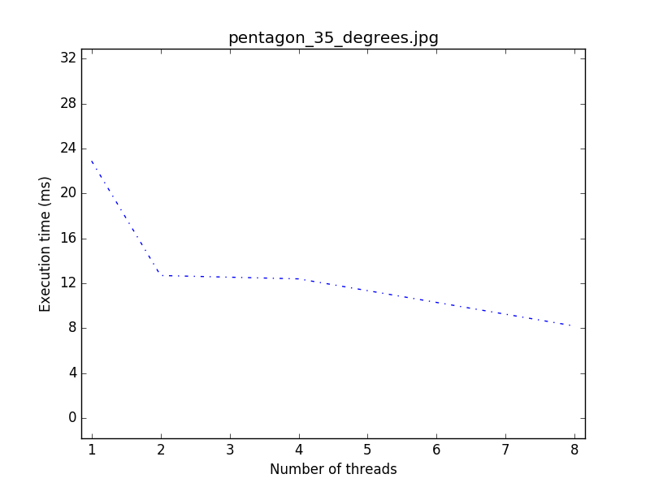
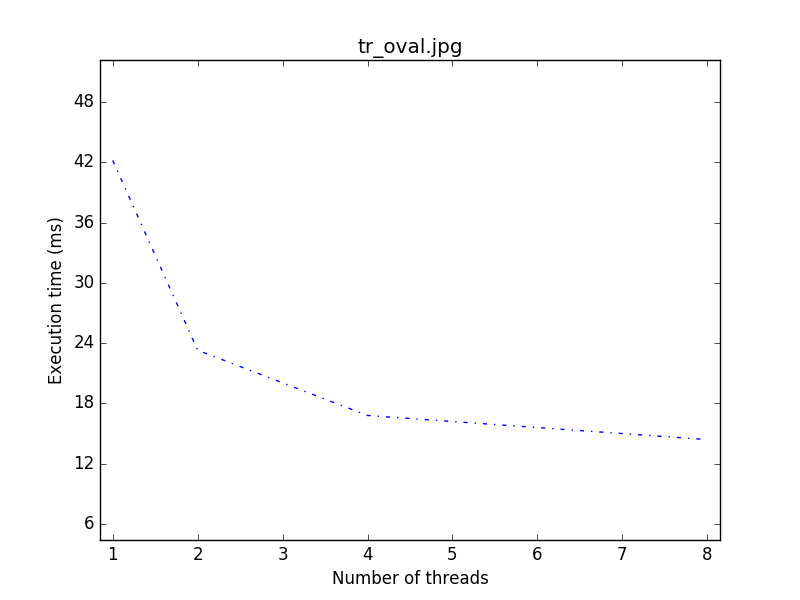
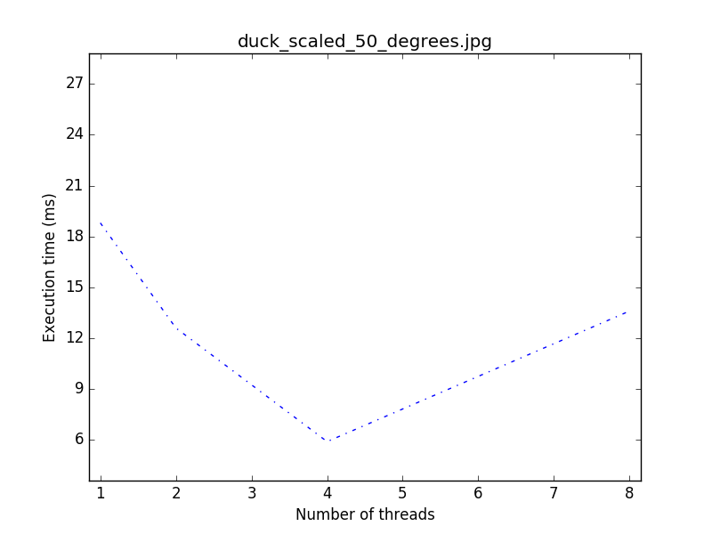
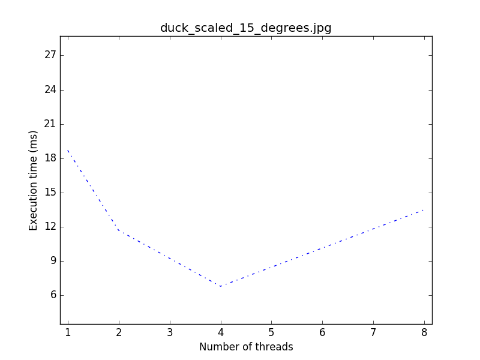
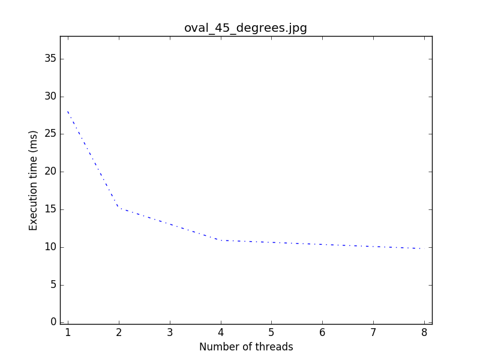
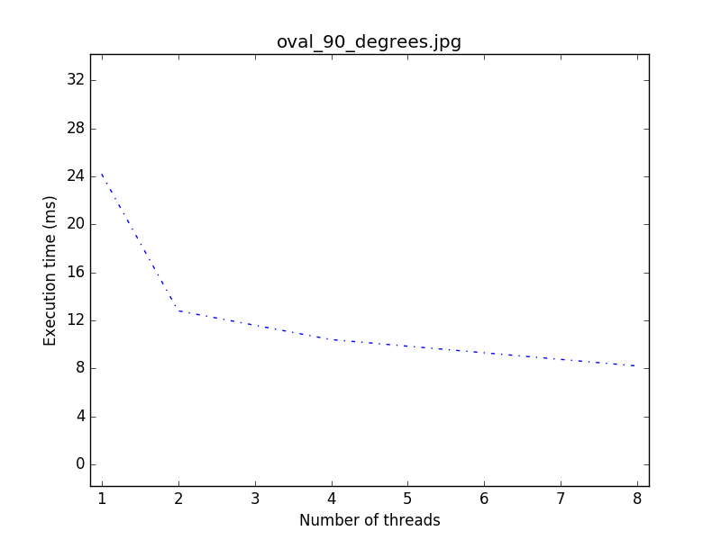
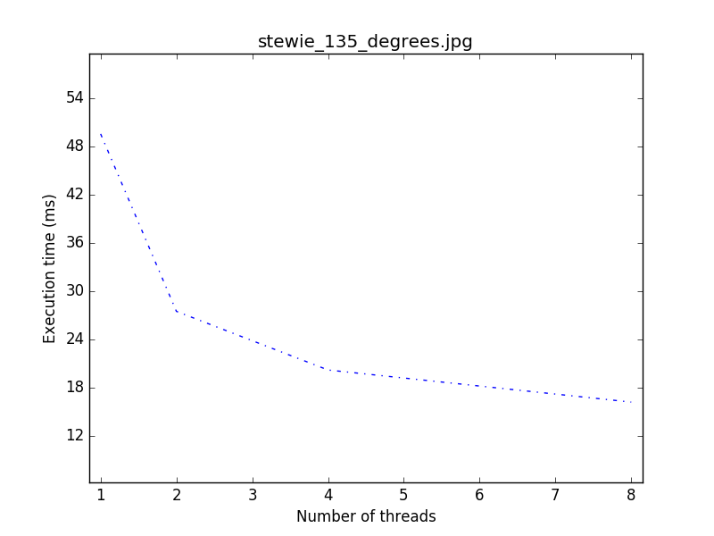
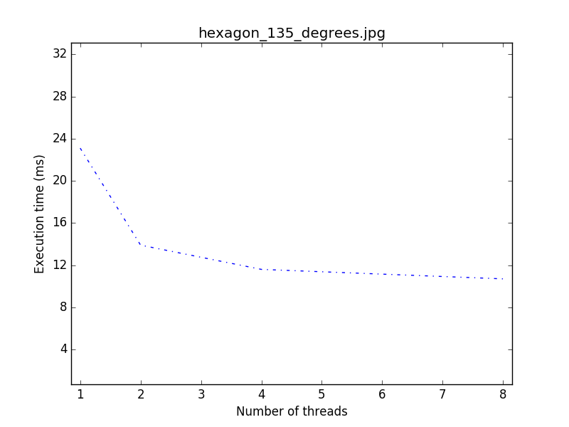

# SHARP
SHARP is a parallel algorithm for shape recognition designed by C. P. Ravikumar and Rajender Sethi.

This repository contains its implementation in C++ exploiting OpenMP parallel programming model. It also leverages on OpenCV to efficiently handle images.

## Scalability test
The following results have been collected on a Macbook Pro Mid-2012 shipping a 
Intel(R) Core(TM) i7-3615QM CPU @ 2.30GHz.

SHARP scalability tests have been run with a maximum of 8 threads 
(max number of logical threads on the machine) in a live system.

#### Results (8 threads max)
| Run time [ms] with # of threads:  | 1      | 2      | 4      | 8      |
| --------------------------------- | ------ | ------ | ------ | ------ |
| pentagon_35_degrees.jpg           | 22.90  | 12.70  | 12.40  | 8.20   |
| tr_oval.jpg                       | 42.20  | 23.30  | 16.80  | 14.40  |
| duck_scaled_15_degrees.jpg        | 18.70  | 11.70  | 6.80   | 13.50  |
| duck_scaled_50_degrees.jpg        | 18.80  | 12.60  | 5.90   | 13.60  |
| oval_45_degrees.jpg               | 28.00  | 15.20  | 10.90  | 9.80   |
| oval_90_degrees.jpg               | 24.20  | 12.80  | 10.40  | 8.20   |
| stewie_135_degrees.jpg            | 49.60  | 27.70  | 27.50  | 16.20  |
| hexagon_135_degrees.jpg           | 23.10  | 13.90  | 11.60  | 10.70  |

#### Graphical plots (8 threads max)

