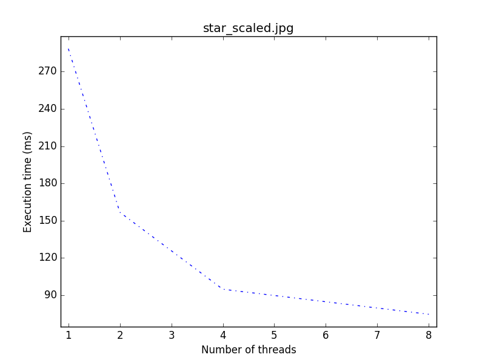
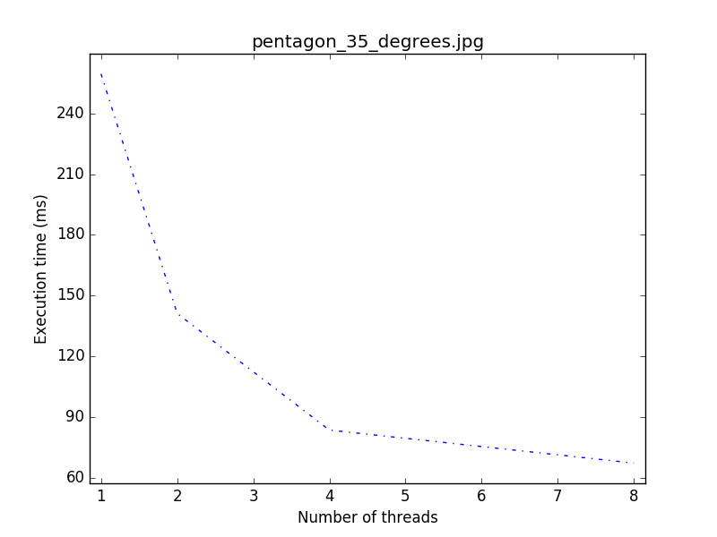
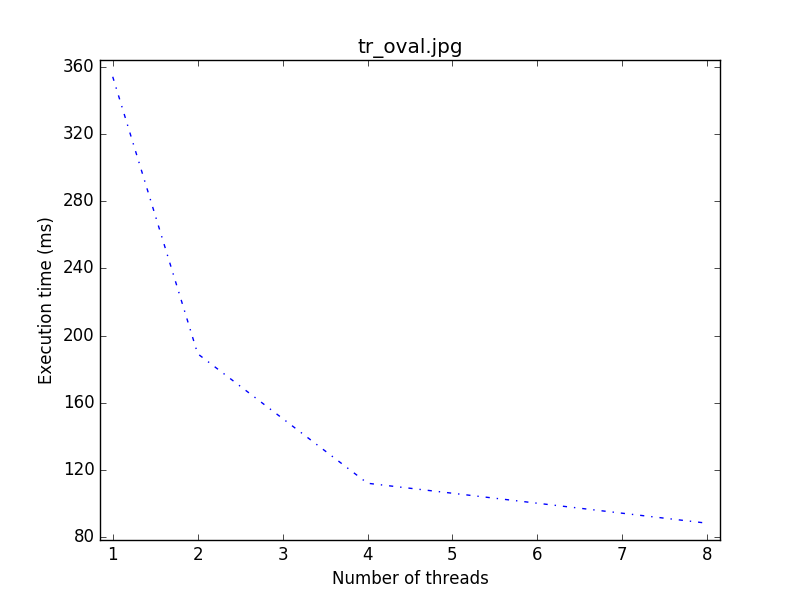
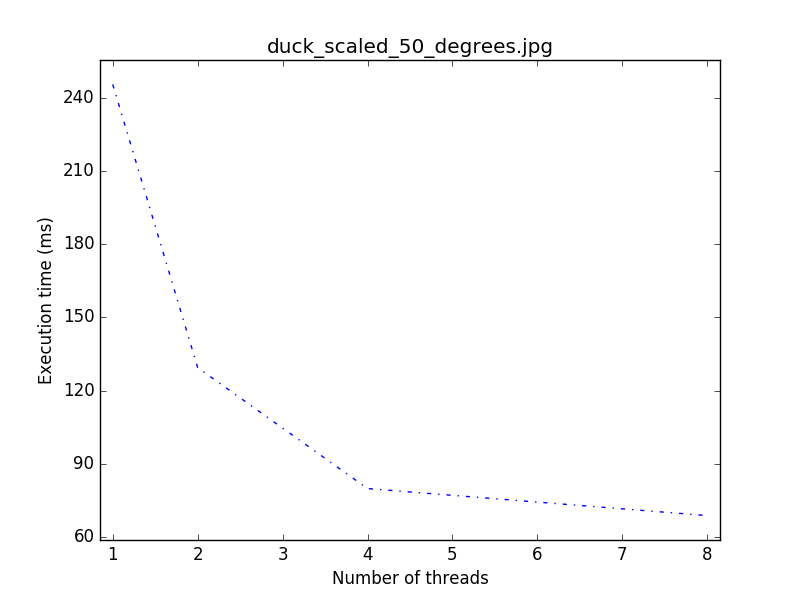
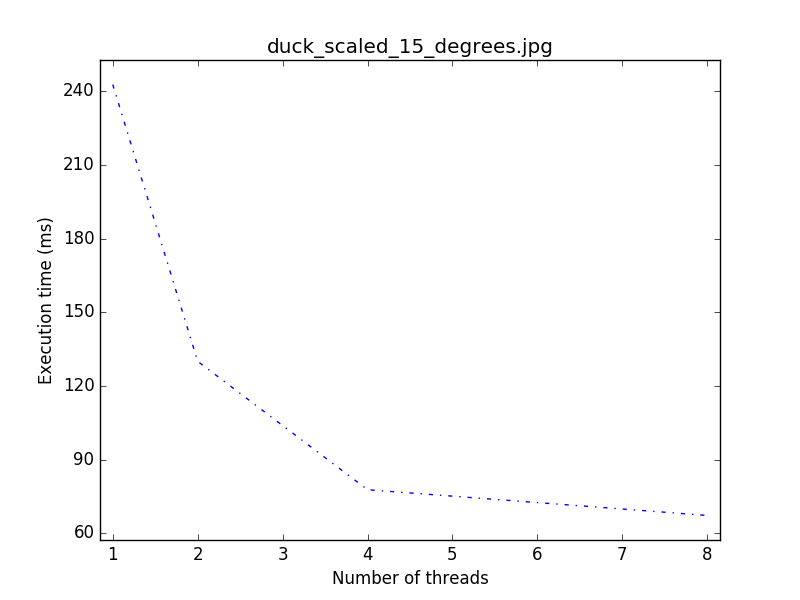
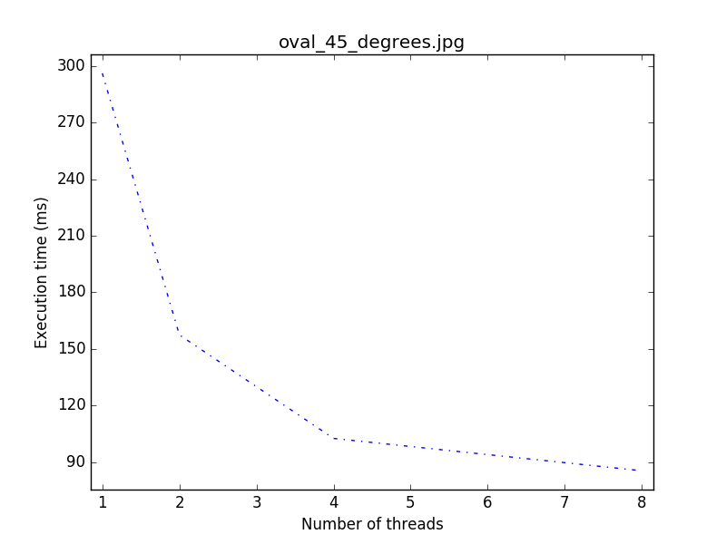
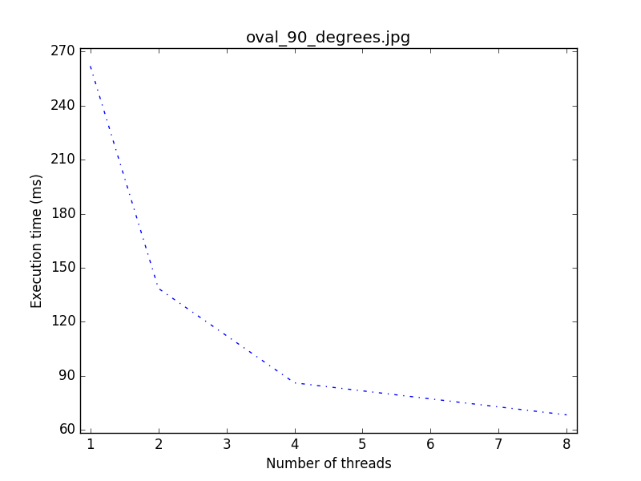
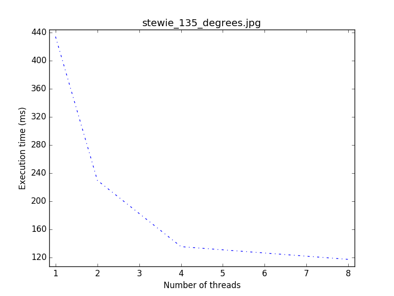
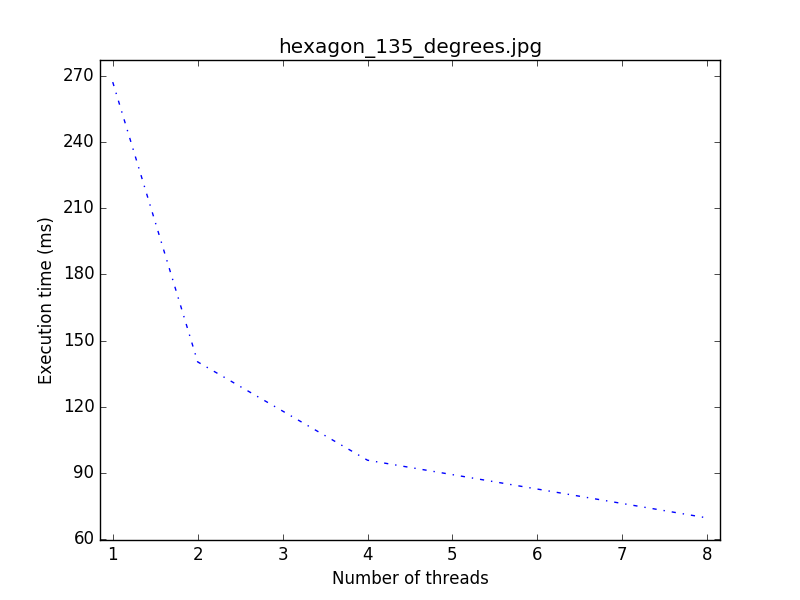

# Scalability test
The following results have been collected on a Macbook Pro Mid-2012 shipping a 
Intel(R) Core(TM) i7-3615QM CPU @ 2.30GHz.

SHARP algorithm has been run with a maximum of 8 threads (max number of logical
threads on the machine) in a live system.

### Textual results
| Run time [ms] with # of threads:  | 1      | 2      | 4      | 8      |
| --------------------------------- | ------ | ------ | ------ | ------ |
| star_scaled.jpg                   | 288.30 | 156.80 | 94.87  | 74.73  |
| pentagon_35_degrees.jpg           | 259.60 | 141.13 | 83:47  | 67.13  |
| tr_oval.jpg                       | 354.20 | 189.2  | 112.07 | 88.27  |
| duck_scaled_50_degrees.jpg        | 245.47 | 129.47 | 79.93  | 68.87  |
| oval_45_degrees.jpg               | 296.13 | 157.4  | 102.53 | 85.40  |
| stewie_135_degrees.jpg            | 434.00 | 229.80 | 135.60 | 117.53 |
| hexagon_135_degrees.jpg           | 267.07 | 140.33 | 95.80  | 69.67  |
| oval_90_degrees.jpg               | 262.00 | 138.53 | 86.07  | 68.27  |
| duck_scaled_15_degrees.jpg        | 242.73 | 130.07 | 77.80  | 67.33  |

### Graphical plots

